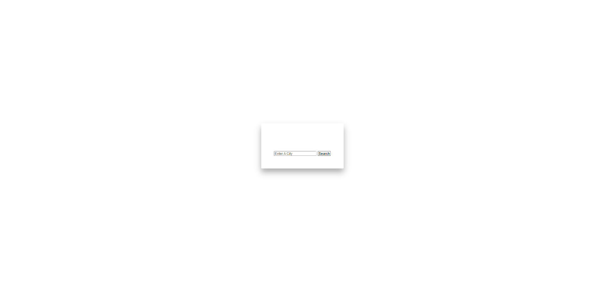
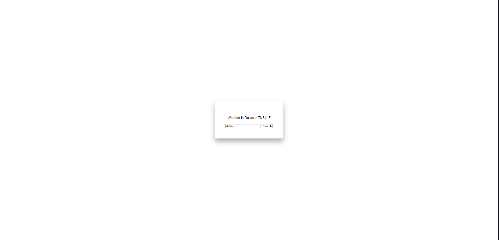
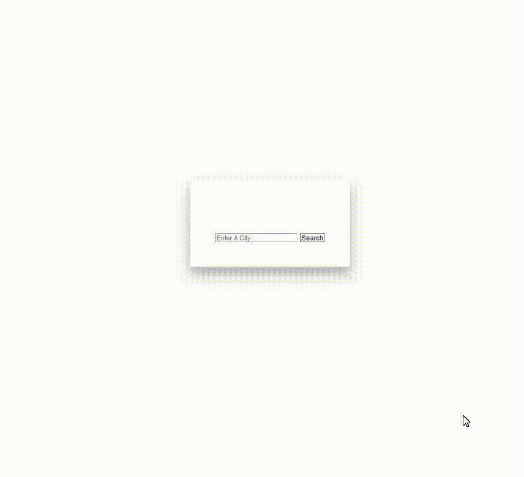
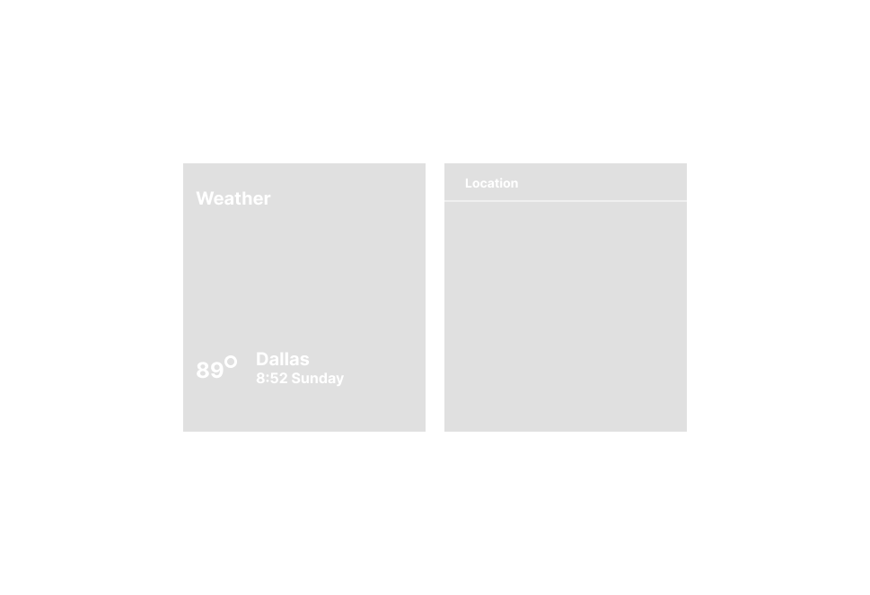

# Nicks Weather Forecast

#### A web app designed to log weather in any city.

## Description
A simple weather app that is able to log weather in any city.

## Technologies Used
* HTML5
* CSS3
* JavaScript
* jQuery
* aJax
* Openweather api

## Features
* App pulls live weather information from 3rd party API

## Whiteboard Images
* All Sketches are on figma

## Project Next Steps
* Users will be able to see current weather on all views
* More attractive design

* You can view the repository:
[Github.com](https://github.com/nicholasmolina2019/Weather-Project)
* You can view this site:
[NicksWeatherApp](https://www.weatherprojectnick.com/)
    
## Works Cited:
* https://openweathermap.org/current#data
* https://seir-batch.netlify.app/frontend-fundamentals/week-2/day-5/lecture-materials/intro-to-ajax-and-javascript-promises/
* https://api.jquery.com/jquery.ajax/

